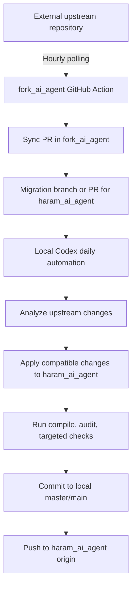

# Upstream Sync to Haram Migration Automation Plan

## 1. 목적

이 문서는 `fork_ai_agent`가 외부 원본 저장소의 변경사항을 주기적으로 감지하고, 그 변경사항을 `haram_ai_agent`에 안전하게 반영하기 위한 자동화 설계와 실행 절차를 정리한다.

목표는 다음과 같다.

- 외부 원본 저장소가 사용자의 저장소가 아니어도 변경사항을 감지한다.
- `fork_ai_agent`는 원본 코드 추적과 동기화 전용 저장소로 사용한다.
- `haram_ai_agent`는 제품화된 Haram AI Agent 저장소로 유지한다.
- 원본 변경사항은 바로 `haram_ai_agent`에 병합하지 않고, PR과 로컬 Codex 검토를 거쳐 마이그레이션한다.
- 최종 반영은 로컬 PC에서 검증 후 `haram_ai_agent`의 `master` 또는 `main`에 커밋하고 원격 저장소로 푸시한다.

## 2. 현재 저장소 기준

현재 로컬 기준은 다음과 같다.

| 구분 | 로컬 경로 | 원격 저장소 | 기본 브랜치 |
| --- | --- | --- | --- |
| Fork 프로젝트 | `D:\Github\ai_agent\fork_project` | `https://github.com/ahnharam/connect-ai.git` | `main` |
| Haram 프로젝트 | `D:\Github\ai_agent\haram_project` | `https://github.com/ahnharam/ai_agent_use` | `master` |

원본 upstream 기준:

- 외부 원본 저장소 URL: `https://github.com/wonseokjung/connect-ai.git`
- `fork_project` 로컬 remote: `upstream`

중요한 전제:

- `fork_ai_agent`는 원본 저장소와 최대한 가까운 상태를 유지한다.
- `haram_ai_agent`는 `fork_ai_agent`를 기반으로 리빌딩된 별도 제품이다.
- 두 저장소는 목적이 다르므로, 원본 변경사항을 단순 복사하거나 자동 병합하면 안 된다.

## 3. 권장 전체 흐름



이 구조를 쓰는 이유:

- 외부 원본 저장소에는 사용자가 Actions나 Webhook을 설치할 수 없을 수 있다.
- GitHub Actions의 `schedule` 이벤트로 주기적 폴링을 하면 원본 저장소 권한이 없어도 변경 감지가 가능하다.
- `haram_ai_agent`는 이미 제품 방향이 다르므로, 원본 변경사항을 자동 병합하는 대신 마이그레이션 큐로 취급해야 한다.
- 로컬 Codex가 매일 한 번 검토하면 자동화 편의성과 제품 안정성 사이의 균형을 잡을 수 있다.

## 4. 사전 준비

다른 컴퓨터에서 진행할 때 필요한 도구:

- Git
- Node.js LTS
- npm
- GitHub CLI `gh`
- Codex Desktop
- `fork_ai_agent`, `haram_ai_agent` 로컬 클론

GitHub CLI 로그인:

```powershell
gh auth login
gh auth status
```

로컬 저장소 확인:

```powershell
git -C D:\Github\ai_agent\fork_project status --short --branch
git -C D:\Github\ai_agent\haram_project status --short --branch
```

`fork_ai_agent`에 원본 저장소 remote가 없다면 추가한다.

```powershell
git -C D:\Github\ai_agent\fork_project remote add upstream https://github.com/wonseokjung/connect-ai.git
git -C D:\Github\ai_agent\fork_project fetch upstream
```

## 5. GitHub Actions 설계

### 5.1 `fork_ai_agent`: 원본 저장소 폴링

`fork_ai_agent`에는 1시간마다 원본 저장소를 확인하는 workflow를 둔다.

역할:

- `upstream` remote에서 최신 변경사항을 가져온다.
- 변경사항이 있으면 `sync/upstream-YYYYMMDD-HHMM` 같은 브랜치를 만든다.
- `fork_ai_agent`의 `main` 대상으로 PR을 생성한다.
- PR 제목에는 upstream commit 범위를 포함한다.

권장 파일:

```text
fork_project/.github/workflows/poll-upstream.yml
```

핵심 동작:

- `on.schedule`: 1시간 간격 실행
- `workflow_dispatch`: 수동 실행 지원
- `git fetch upstream`
- `git merge-base` 또는 commit SHA 비교
- 변경이 있을 때만 PR 생성

주의:

- GitHub Actions schedule은 정확히 정각에 실행된다는 보장이 없다.
- 공개 원본 저장소라면 별도 토큰 없이 fetch 가능하다.
- private 원본 저장소라면 읽기 권한이 있는 PAT 또는 deploy key가 필요하다.

### 5.2 `haram_ai_agent`: 마이그레이션 PR 수신

`haram_ai_agent`에는 원본 변경사항을 직접 병합하지 않고, 마이그레이션 검토용 PR만 생성한다.

권장 방식:

- `fork_ai_agent`의 sync PR이 생성되면 별도 workflow 또는 수동 승인으로 `haram_ai_agent`에 `migration/upstream-YYYYMMDD` 브랜치를 만든다.
- PR 본문에는 다음 내용을 포함한다.
  - upstream commit 범위
  - 변경 파일 목록
  - 자동 적용 가능 후보
  - 충돌 예상 파일
  - Haram 제품 방향과 충돌할 수 있는 기능

권장 파일:

```text
haram_project/.github/workflows/migration-intake.yml
```

초기 v0에서는 완전 자동 적용보다 "PR 생성 및 분석 리포트 작성"까지만 자동화하는 것이 안전하다.

## 6. 로컬 Codex 자동화 설계

로컬 PC에서는 매일 아침 한 번 Codex 자동화를 실행한다.

역할:

- GitHub CLI로 `haram_ai_agent`의 마이그레이션 PR을 조회한다.
- PR의 변경사항과 upstream 범위를 읽는다.
- 현재 로컬 `master` 또는 `main`을 최신화한다.
- 새 로컬 작업 브랜치를 만든다.
- 원본 변경사항 중 Haram 제품에 필요한 부분만 적용한다.
- 빌드와 검증을 실행한다.
- 성공하면 로컬 기본 브랜치에 커밋하고 원격에 푸시한다.
- 실패하면 커밋하지 않고 리포트만 남긴다.

권장 자동화 이름:

```text
Haram upstream migration review
```

권장 실행 시간:

```text
매일 오전 09:00 Asia/Seoul
```

Codex 자동화 프롬프트에 포함할 핵심 지시:

```text
Check open migration PRs in ahnharam/ai_agent_use.
Use gh to inspect PR metadata, changed files, and checks.
Apply only compatible upstream changes to the local haram_ai_agent repository.
Preserve Haram product identity, haramAi settings, haram-ai-agent command IDs, and the AI software-company agent model.
Run npm install if package files changed.
Run npm run compile and npm audit.
Commit successful migrations to the local default branch and push to origin.
If checks fail or the change conflicts with the Haram direction, do not commit; summarize the blocker.
```

## 7. 로컬 마이그레이션 작업 규칙

Codex가 자동 마이그레이션할 때 지켜야 할 불변 조건:

- `haram_ai_agent`의 제품명은 `Haram AI Agent — AI Software Company`로 유지한다.
- extension name은 `haram-ai-agent`로 유지한다.
- 설정 prefix는 `haramAi.*`로 유지한다.
- command namespace는 `haram-ai-agent.*` 또는 `haramAi.*`만 사용한다.
- 기본 brain 경로는 `~/.haram-ai-brain`으로 유지한다.
- 기본 회사 폴더는 `<brain>/_company`로 유지한다.
- 기본 에이전트는 다음 9개 역할을 유지한다.
  - `ceo`
  - `business`
  - `planner`
  - `architect`
  - `designer`
  - `frontend`
  - `backend`
  - `dba`
  - `qa`
- YouTube, Instagram, PayPal, 콘텐츠 운영, 댓글 큐, 채널 분석 기능은 v0 기본 흐름에 다시 노출하지 않는다.
- 원본 저장소의 기능이 유용하더라도 Haram 제품 방향과 충돌하면 legacy 또는 planned 영역으로 분리한다.

## 8. 자동 적용 후보와 수동 검토 후보

자동 적용 가능성이 높은 변경:

- 보안 패치
- dependency 취약점 해결
- TypeScript compile 오류 수정
- VS Code API 호환성 개선
- 공통 유틸리티 버그 수정
- 테스트 안정화
- 빌드 스크립트 개선

수동 검토가 필요한 변경:

- agent 역할 구조 변경
- command ID 변경
- settings prefix 변경
- brain 경로 변경
- dashboard UX 변경
- YouTube, Instagram, PayPal, 콘텐츠 자동화 기능 추가
- 인증, OAuth, 외부 서비스 연동
- 데이터 저장 구조 변경
- package major version upgrade

## 9. 추천 브랜치 전략

`fork_ai_agent`:

- 기본 브랜치: `main`
- upstream sync 브랜치: `sync/upstream-YYYYMMDD-HHMM`
- PR 대상: `main`

`haram_ai_agent`:

- 기본 브랜치: 현재 기준 `master`
- migration PR 브랜치: `migration/upstream-YYYYMMDD`
- Codex 로컬 작업 브랜치: `codex/migrate-upstream-YYYYMMDD`
- 최종 성공 시: `master`에 fast-forward 또는 merge commit 후 `origin/master` push

추후 `haram_ai_agent` 기본 브랜치를 `main`으로 바꾸면 자동화 문서와 스크립트의 기본 브랜치도 함께 바꾼다.

## 10. 검증 절차

마이그레이션 후 최소 검증:

```powershell
cd D:\Github\ai_agent\haram_project
npm install
npm run compile
npm audit
```

잔여 legacy 노출 확인:

```powershell
rg "connectAiLab|connect-ai|YouTube|Instagram|PayPal|channel|comment queue" D:\Github\ai_agent\haram_project
```

Haram 식별자 확인:

```powershell
rg "haram-ai-agent|haramAi|Haram AI Agent|.haram-ai-brain" D:\Github\ai_agent\haram_project
```

에이전트 역할 확인:

```powershell
rg "ceo|business|planner|architect|designer|frontend|backend|dba|qa" D:\Github\ai_agent\haram_project\src
```

## 11. 실패 처리 기준

다음 경우에는 자동 커밋하지 않는다.

- `npm run compile` 실패
- `npm audit`에서 high 이상 취약점 발생
- migration PR의 변경 의도를 파악할 수 없음
- Haram 제품 식별자가 원본 식별자로 되돌아감
- YouTube 또는 콘텐츠 운영 기능이 기본 UI에 재노출됨
- 데이터 경로가 `~/.connect-ai-brain` 등 원본 경로로 되돌아감
- agent 역할이 기존 9개 구조와 충돌함

실패 시 남길 리포트:

- PR 번호
- upstream commit 범위
- 실패한 명령
- 충돌 파일
- 자동 적용하지 않은 이유
- 다음 사람이 수동으로 봐야 할 항목

## 12. 단계별 도입 순서

### Phase 1: 수동 기반 준비

- 다른 컴퓨터에 두 저장소를 클론한다.
- `gh auth login`을 완료한다.
- `fork_ai_agent`에 `upstream` remote를 등록한다.
- `haram_ai_agent`에서 현재 `npm run compile`, `npm audit`가 통과하는지 확인한다.

### Phase 2: `fork_ai_agent` 폴링 workflow 추가

- `.github/workflows/poll-upstream.yml`을 추가한다.
- 수동 `workflow_dispatch`로 먼저 테스트한다.
- upstream 변경이 없을 때 PR을 만들지 않는지 확인한다.
- 테스트용 브랜치에서 변경 감지와 PR 생성이 되는지 확인한다.

### Phase 3: `haram_ai_agent` 마이그레이션 intake 추가

- `.github/workflows/migration-intake.yml` 또는 수동 PR 템플릿을 추가한다.
- migration PR 본문에 upstream 범위와 변경 파일 목록이 들어가게 한다.
- 초기에는 자동 코드 적용을 하지 않고 분석 리포트 중심으로 운영한다.

### Phase 4: 로컬 Codex 자동화 추가

- Codex Desktop에서 매일 오전 실행되는 자동화를 만든다.
- 자동화가 `gh pr list`, `gh pr view`, `gh pr diff`를 사용할 수 있는지 확인한다.
- 첫 주에는 커밋과 푸시를 비활성화하고 리포트 모드로만 실행한다.
- 결과가 안정적이면 커밋과 푸시를 활성화한다.

### Phase 5: 운영 기준 강화

- 마이그레이션 PR 라벨을 도입한다.
  - `upstream-sync`
  - `migration-candidate`
  - `needs-human-review`
  - `safe-auto-apply`
- 보안 패치와 dependency 패치는 우선 처리한다.
- 제품 방향을 바꾸는 변경은 항상 수동 승인으로 처리한다.

## 13. 다른 컴퓨터에서 바로 시작할 체크리스트

1. Git, Node.js LTS, npm, GitHub CLI, Codex Desktop 설치
2. `gh auth login` 완료
3. `D:\Github\ai_agent` 아래에 두 저장소 클론
4. `fork_ai_agent`에 원본 저장소를 `upstream` remote로 추가
5. `haram_ai_agent`에서 `npm install`, `npm run compile`, `npm audit` 실행
6. `fork_ai_agent/.github/workflows/poll-upstream.yml` 작성
7. GitHub Actions에서 수동 실행으로 sync PR 생성 테스트
8. `haram_ai_agent`에 migration PR 생성 방식 결정
9. Codex Desktop에서 매일 오전 마이그레이션 검토 자동화 생성
10. 첫 실행은 리포트 모드로 검증
11. 안정화 후 커밋과 푸시까지 허용

## 14. 아직 결정해야 할 값

다른 컴퓨터에서 실제 구현 전에 아래 값을 확정해야 한다.

| 항목 | 현재 권장값 | 확정 필요 여부 |
| --- | --- | --- |
| 외부 원본 저장소 URL | `https://github.com/wonseokjung/connect-ai.git` | 확정 |
| `fork_ai_agent` 기본 브랜치 | `main` | 확인 완료 |
| `haram_ai_agent` 기본 브랜치 | `master` | 현재 기준 확정 |
| 로컬 자동화 실행 시간 | 매일 09:00 Asia/Seoul | 변경 가능 |
| 첫 주 운영 모드 | 리포트 전용 | 권장 |
| 자동 커밋 허용 범위 | compile/audit 통과한 안전 변경 | 세부 기준 필요 |

## 15. 최종 운영 원칙

`fork_ai_agent`는 원본 변경사항을 받아오는 관문이고, `haram_ai_agent`는 제품 방향을 지키는 최종 저장소다.

따라서 자동화의 핵심은 "최대한 많이 자동 병합"이 아니라 "원본 변경사항을 놓치지 않고, Haram 제품에 맞는 것만 안전하게 선별 적용"하는 것이다. 보안 패치와 빌드 안정화는 빠르게 반영하고, 제품 정체성이나 agent 구조에 영향을 주는 변경은 PR과 Codex 리포트를 통해 검토한 뒤 반영한다.
